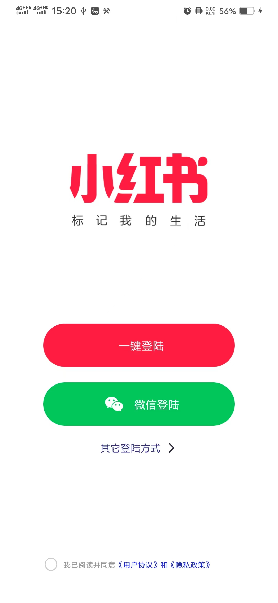
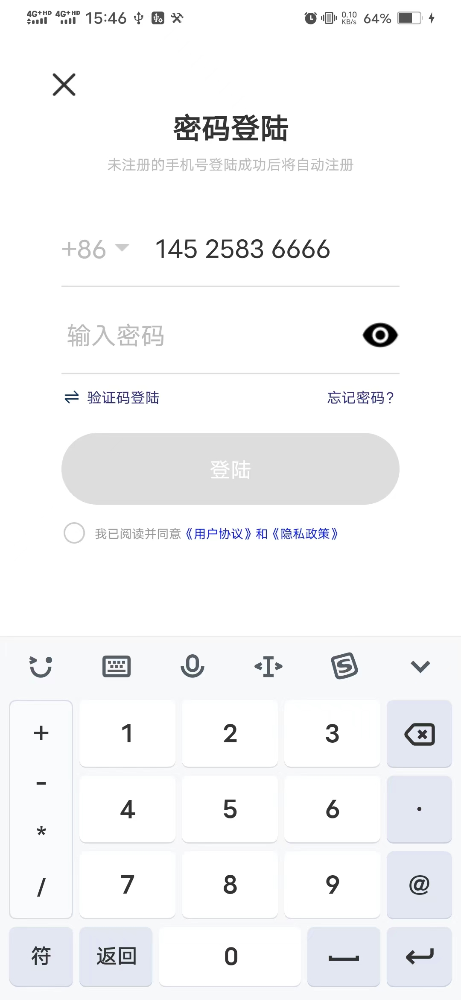
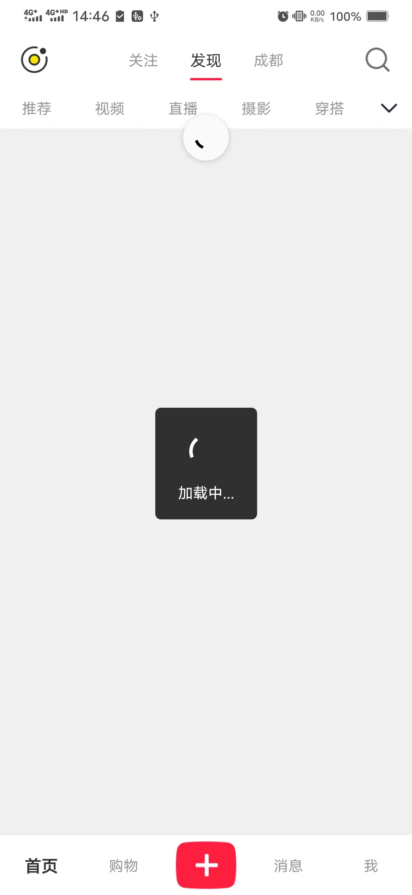
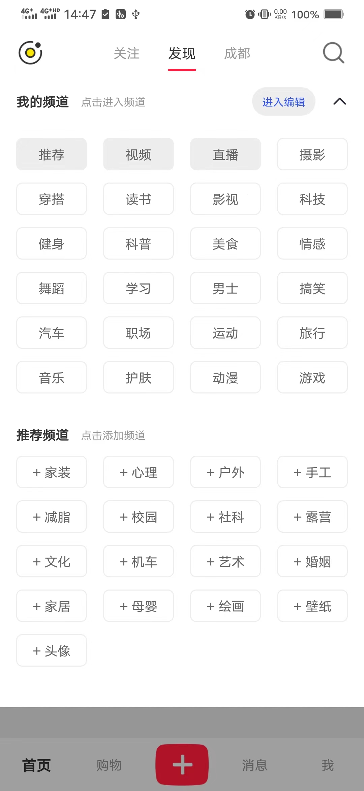
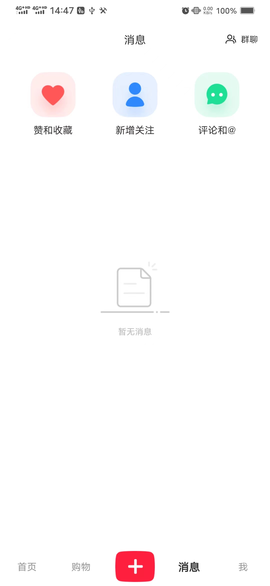
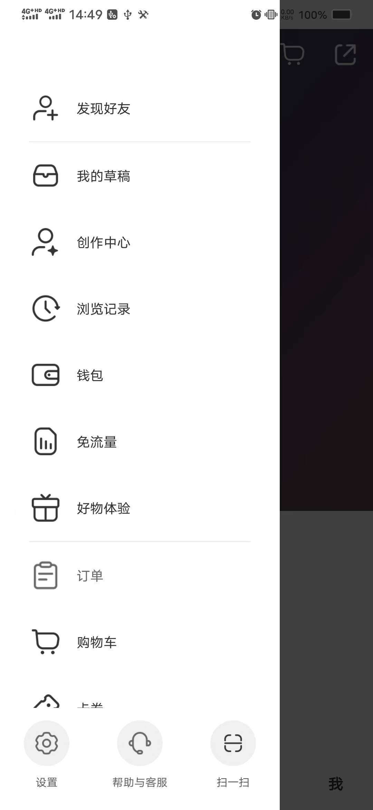

## Environment

-   JDK 11.0.2 / JDK 17.0.1
-   Node 14.18.0 / Node 18.14.0
-   React-Native 0.71.8 (低于 0.67 版本的 React Native 需要 JDK 1.8 版本)
-   Android Studio : android-studio-2022.2.1.19-windows

#### 启动服务端

```shell
cd ./server

npm install

npm run dev
```

#### 启动客户端

在项目根目录下运行

```shell
npm install

npm run android
```

tips: 需要保证 android 端能访问到 server 提供的服务

## Example Pages

登录页:

-   <div align=center>
        
    </div>

-   <div align=center>
        
    </div>

-   <div align=center>
        
    </div>

首页:

-   <div align=center>
        
    </div>

-   <div align=center>
        
    </div>

消息页:

-   <div align=center>
        
    </div>

-   <div align=center>
        
    </div>

个人中心页:

-   <div align=center>
        
    </div>

-   <div align=center>
        
    </div>
